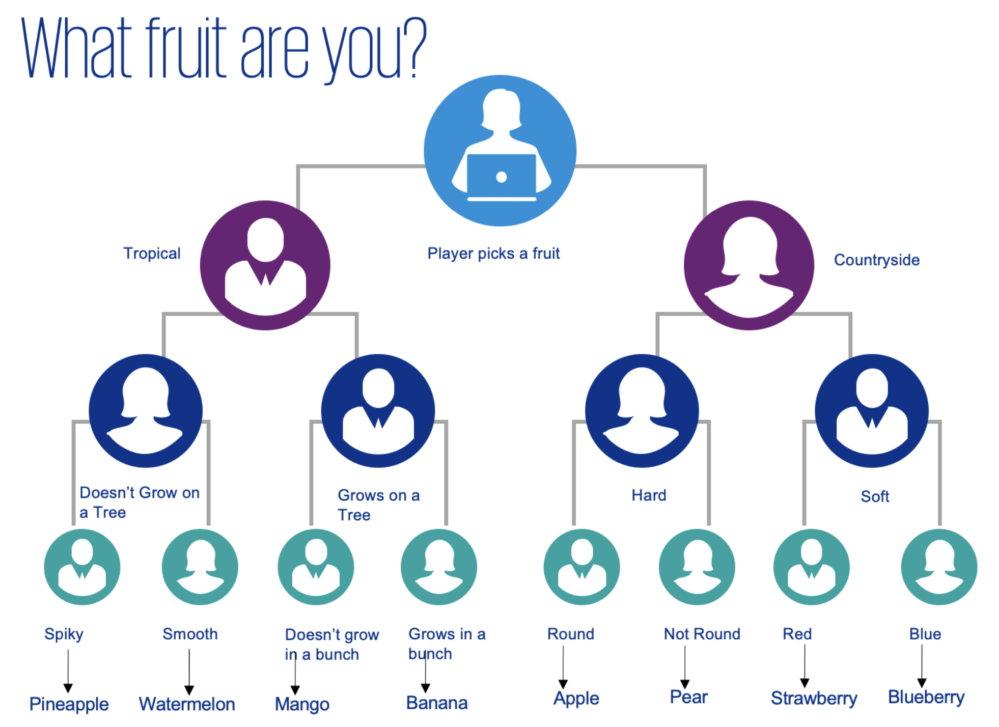

# [fit] Guess The Fruit

---


---


# [fit] What's programming?

---

# [fit] What's Python?

---

# [fit] Who uses it?

---

# Text Editor

---

# [fit] trinket.io

---

# Hello, World!

---

# Hello, World!

```python
print("Hello, World!")
```

---

# Link 1 

---

# Start the Game!

```python
print("Welcome to Guess The Fruit")
```

---


# Variables

---

# Variables

```python
<variable_name> = <value>
```

---

# Variables

```python
name = "Charlie"
age = 27
left_to_pay = 29.99
has_paid = False
```

---

# Variables

- Any mix of letters, numbers and some special characters
- Must start with a letter
- Keep lowercase
- Use underscore where there are spaces

---

# Writing Python

- You are not writing an essay...
- Keep things lowercase
- Don't use punctuation
- Replace spaces with underscores

---

# Data Types

---

# Strings

---

# Strings

Characters surrounded by quotes

```python
name = "Alice"
address = "123 Station Road"
favourite_food = "Pizza"
```

---

# Escaping

---

# Escaping

```
\n = New line
\t = Tab
\" = Double Quote
```

---
# Escaping

```python
favourite_food = "Pizza from \"Dough N' Sauce\""
shopping_list = "Apples\nBread\nMilk\nEggs"
```

---

# Link 2 

---

# Integer

---

# Integer

A whole number

```python
age = 17
days_in_january = 31
bottles_sitting_on_the_wall = 99
```

----

# Float

----

# Float

A decimal number

```python
price = 12.99
percent = 34.57
pi = 3.1415
```

---

# Numerical Operators

---

# Numerical Operators

| Operator | Action | Example |
| --- | --- | --- |
| + | Addition | `1 + 2` |
| - | Subtraction | `3 - 1` |
| * | Multiplication | `3 * 7` |
| / | Division | `9 / 3` |
| ** | Exponent | `4 ** 2` |
| % | Modulus (remainder) | `10 % 3` |

---

# Numerical Operators

```python
print(1 + 2)
print(5 - 3)
print(3 * 7)
print(49 / 7)
print(4 ** 2)
print(10 % 3)
```

--- 

# Numerical Operators

```python
x = 3
y = 6
area = x * y
```

---

# Link 3 

---

# Concatenation

---

# Concatenation

```python
first_name = "Bob"
last_name = "Jones"
full_name = first_name + " " + last_name

print("Hello " + first_name)
print("Good morning, " + full_name)
```

---

# Link 4

---

# Input

---

# Input

```python
name = input("What's your name? ")

print("Hello " + name)
```

---

# Link 5

---

# Conditionals

---

# If

---

# If

```python
total = 1 + 2

if total == 3:
    print("This message is always shown")

```

---

# Else

---

# Else

```python
total = 2 + 3

if total == 3:
    print("This message is NOT shown")
else:
    print("This message is shown")    
```

---

# Else

```python
age = 16

if age >= 18:
    print("You can vote")
else:
    print("You're not old enough to vote")
```

---

# Link 6

---


# Else

```python
is_tropical = input("Is the fruit tropical?")

if is_tropical == "yes":
    is_tree = input("Does the fruit grow on a tree?")
    if is_tree == "yes":
      print("You picked a tropical fruit that grows on a tree")
    else:
      print("You picked a tropical fruit that doesn't grow on a tree")
else:
    print("You picked a countryside fruit")
```

---


# Link 7

---


---

# Guess the Fruit

---

# Link 8

---

# Your Game 
- Animals
- Celebrities
- TV Show
- Food
- Music

---


---
# Thanks :)
