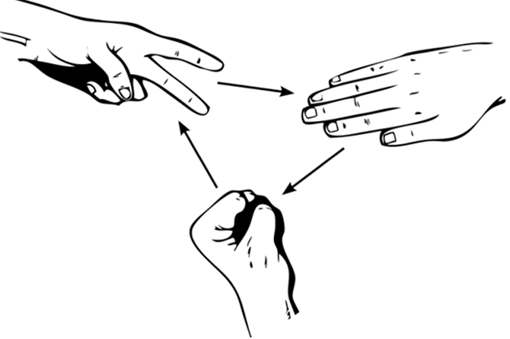

# [fit] KPMG: Code
## Intro to Coding
#### Rock, Paper, Scissors with Python

---

# [fit] Overview

---

# [fit] What is programming?

---

# [fit] What is Python?

---

# [fit] What's it used for?

---

# [fit] Who uses it?

---

# Rock, Paper, Scissors

---



[^1]: http://thescienceexplorer.com/universe/how-win-rock-paper-scissors-according-math

---

# Hello, World!

---

# Hello, World!

```python
print("Hello, World!")
```

---

# Text Editor

---

# [fit] repl.it

---

# Code with Us: 1

```python
print("Welcome to Rock, Paper, Scissors")
```

---

# Question 1 

---

# Variables

---

# Variables

```python
name = "Charlie" # String
age = 27 # Integer
left_to_pay = 29.99 # Float
has_paid = False # Boolean
```

---

# Numerical Operators

---

# Numerical Operators

| Operator | Action | Example |
| --- | --- | --- |
| + | Addition | `1 + 2` |
| - | Subtraction | `3 - 1` |
| * | Multiplication | `3 * 7` |
| / | Division | `9 / 3` |

---

# Numerical Operators

```python
print(1 + 2)
print(5 - 3)
print(3 * 7)
print(49 / 7)
```

---

# Concatenation

---

# Concatenation

```python
first_name = "Bill"
last_name = "Michael"
full_name = first_name + " " + last_name

print("G'day " + first_name)
print("How ya goin', " + full_name)
```

---

# Input

---

# Input

```python
name = input("What's your name? ")

print("Hello " + name)
```

---

# Code with Us: 2

```python
user_choice = input("What is your move? (rock, paper, scissors) ")
print("You picked " + user_choice)
```

---

# Putting it all together

```python
print("Welcome to Rock, Paper, Scissors")

user_choice = input("What is your move? (rock, paper, scissors) ")
print("You picked " + user_choice)
```

---

# Question 2 & 3 

---

# Conditionals

---

# If

---

# If

```python
if 1 == 1:
    print("This is always shown")

if 3 == 5:
    print("This is never shown")    
```

---

# Indenting

---

# Indenting

```python
name = "Lisa"

if name == "Lisa":
    print("Hello Lisa")
```

---

# Comparators

| Comparator |  Description | Example |
|--- | --- | --- |
| == | Equals | "Lisa" == "Lisa"
| != | Does not equal | "Bill" != "Catherine"
| < | Less than | 4 < 10
| > | Greater than | 12 > 8
| <= | Less than or equal to | 7 <= 7
| >= | Greater than or equal to | 8 >= 5

---

# Else

---

# Else

```python
if 1 == 1:
    print("Yes")
else:
    print("No")    
```

---

# Else

```python
age = 16

if age >= 18:
    print("You can vote.")
else:
    print("You cannot vote.")
```

---

# Elif

---

# Elif

```python
user_choice = input("What is your move? (rock, paper, scissors) ")

if user_choice == "paper":
    print("You picked paper")
elif user_choice == "scissors":
    print("You picked scissors")
else:
    print("You picked rock")
```

---

# Code with Us: 3

```python
if user_choice == "rock":
    print("You picked rock")
elif user_choice == "paper":
    print("You picked paper")
else:
    print("You picked scissors")
```

---

# Putting it all together

```python
print("Welcome to Rock, Paper, Scissors")

user_choice = input("What is your move? (rock, paper, scissors) ")
print("You picked " + user_choice)

if user_choice == "rock":
    print("You picked rock")
elif user_choice == "paper":
    print("You picked paper")
else:
    print("You picked scissors")
```

---

# Question 4 & 5  

---

# Random Module

---

# Random Module

```python
import random

# Gets a random number between 1 and 10
number = random.randint(1, 10)
print(number) # 7

print(random.choice(["Alia", "Bill", "Catherine", "Dharmesh", "Eve"]))
```

---

# Code with Us: 4

```python
import random

computer_choice = random.choice(["rock", "paper", "scissors"])
print("The computer picked " + computer_choice)
```

---

# Putting it all together

```python
import random

print("Welcome to Rock, Paper, Scissors")

user_choice = input("What is your move? (rock, paper, scissors) ")
computer_choice = random.choice(["rock", "paper", "scissors"])

print("You picked " + user_choice)
print("The computer picked " + computer_choice)

if user_choice == "rock":
    print("You picked rock")
elif user_choice == "paper":
    print("You picked paper")
else:
    print("You picked scissors")
```

---

# Question 6 & 7  

---

# Code with Us: 5
```python
if user_choice == "rock":
    if computer_choice == "scissors":
        print("You Win")
    elif computer_choice == "paper":
        print("You Lose")
    else:
        print("It's a draw")
```

---

# [fit] Want to learn more?

---

# [fit] Take the full course today
- It's free!
- 10 sessions
- Watch on YouTube in your own time
- Learn to make more games
- Get a KPMG certificate of completion

---

# Putting it all together

---

```python
import random

print("Welcome to Rock, Paper, Scissors")

user_choice = input("What is your move? (rock, paper, scissors) ")
computer_choice = random.choice(["rock", "paper", "scissors"])

print("You picked " + user_choice)
print("The computer picked " + computer_choice)

if user_choice == "rock":
    if computer_choice == "scissors":
        print("You Win")
    elif computer_choice == "paper":
        print("You Lose")
    else:
        print("It's a draw")
elif user_choice == "paper":
    if computer_choice == "rock":
        print("You Win")
    elif computer_choice == "scissors":
        print("You Lose")
    else:
        print("It's a draw")
else:
    if computer_choice == "paper":
        print("You Win")
    elif computer_choice == "rock":
        print("You Lose")
    else:
        print("It's a draw")
```
---

# Question 8 

---

# Thanks :)
